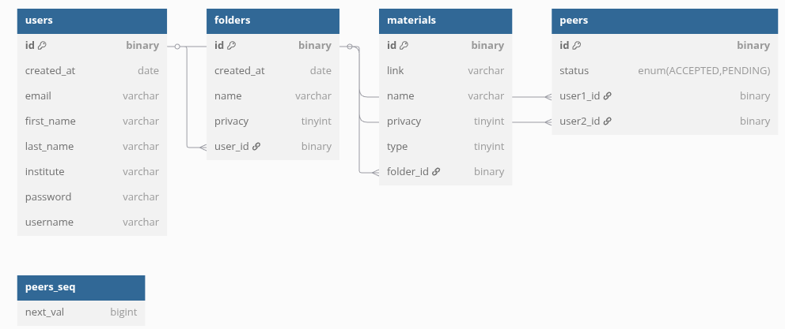
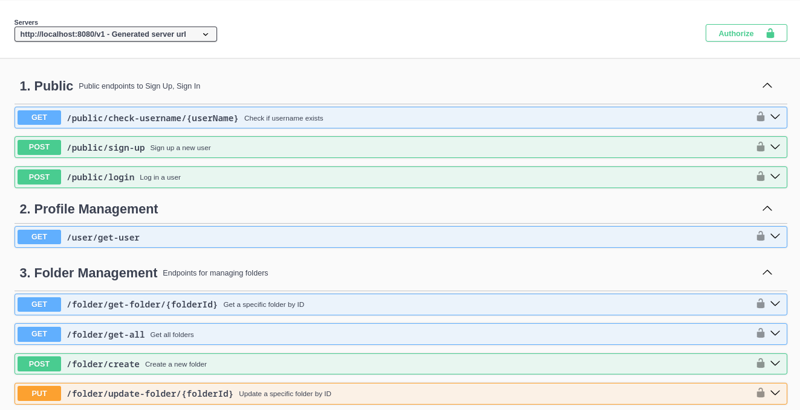
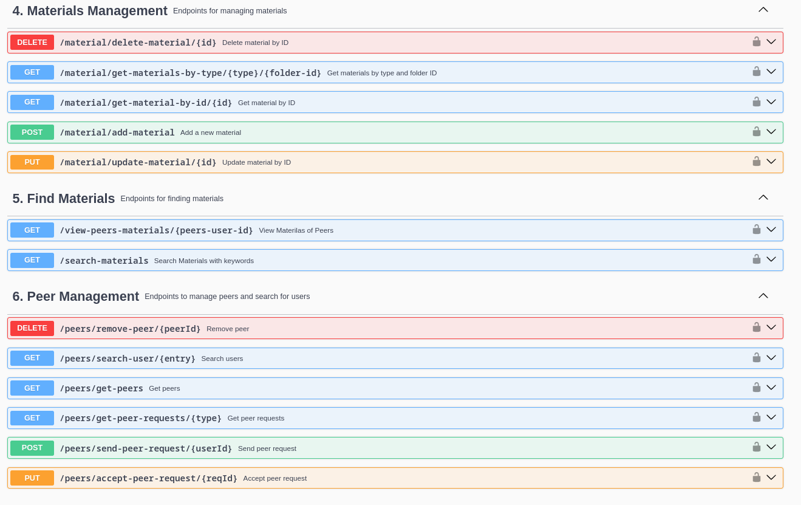
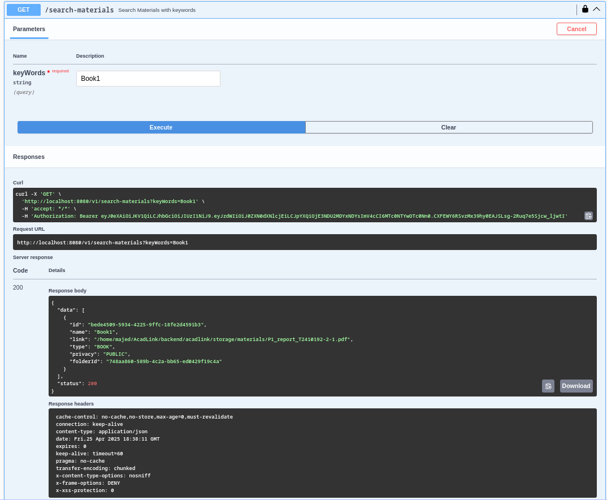
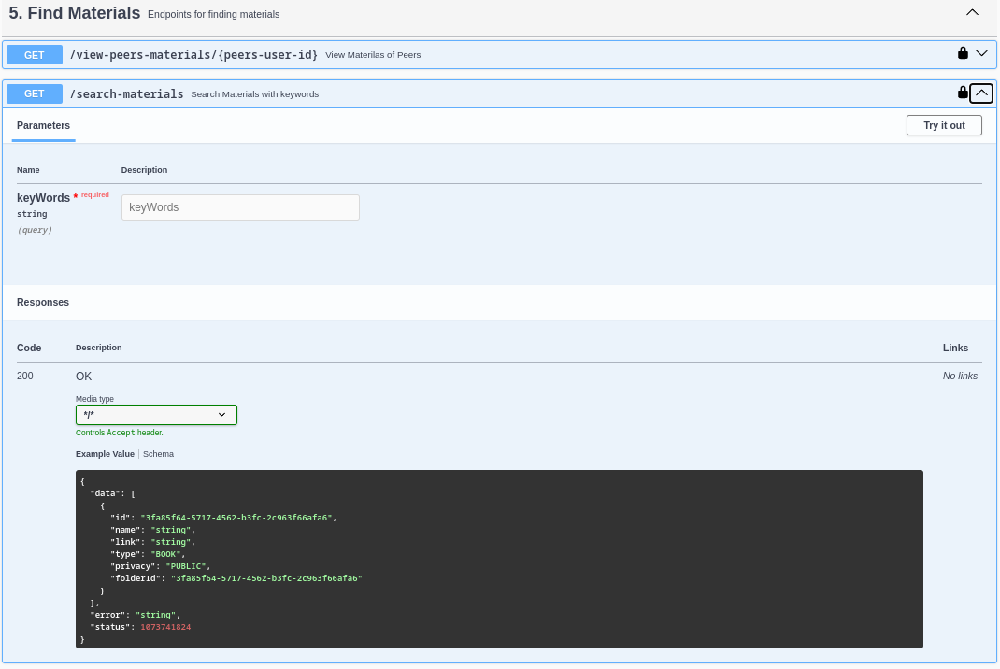

# AcadLink 📚

[](https://www.java.com/)
[](https://spring.io/projects/spring-boot)
[](https://www.mysql.com/)
[](https://jwt.io/)
[](https://swagger.io/)
[](https://maven.apache.org/)
[](https://sonarcloud.io/)

<div align="center">
  <h2>Academic Collaboration Made Simple</h2>
  
  <p align="center">
    <b>AcadLink</b> is a modern academic collaboration platform that enables students to share and manage educational materials while connecting with peers.
    <br />
    <a href="#-getting-started"><strong>Quick Start »</strong></a>
    <br />
    <br />
    <a href="#-key-features">Features</a>
    ·
    <a href="#-database-design">Database Design</a>
    ·
    <a href="#-api-documentation">API Docs</a>
  </p>
</div>

### SonarCloud Analysis

[](https://sonarcloud.io/summary/new_code?id=mr-majed7_AcadLink)
[](https://sonarcloud.io/summary/new_code?id=mr-majed7_AcadLink)
[](https://sonarcloud.io/summary/new_code?id=mr-majed7_AcadLink)
[](https://sonarcloud.io/summary/new_code?id=mr-majed7_AcadLink)
[](https://sonarcloud.io/summary/new_code?id=mr-majed7_AcadLink)
[](https://sonarcloud.io/summary/new_code?id=mr-majed7_AcadLink)
[](https://sonarcloud.io/summary/new_code?id=mr-majed7_AcadLink)
[](https://sonarcloud.io/summary/new_code?id=mr-majed7_AcadLink)

## 📋 Table of Contents

- [Key Features](#-key-features)
- [Technical Stack](#-technical-stack)
- [Security Features](#-security-features)
- [Database Design](#-database-design)
- [API Documentation](#-api-documentation)
- [Getting Started](#-getting-started)
- [Testing & Quality](#-testing--quality)
- [Project Structure](#-project-structure)
- [Author](#-author)

## 🚀 Key Features

- Secure user authentication and profile management
- Material upload and organization with privacy controls
- Folder-based content management
- Peer collaboration and material sharing
- Advanced search capabilities for materials and users

## 🛠 Technical Stack

### Backend

- **Java Version**: 21
- **Framework**: Spring Boot 3.4.1
- **Security**: Spring Security with JWT
- **Database**: MySQL 8
- **Documentation**: Swagger/OpenAPI
- **Testing**: JUnit 5, Mockito
- **Code Quality**: SonarQube, JaCoCo

### Key Dependencies

- Spring Boot Starter Web
- Spring Boot Starter Data JPA
- Spring Boot Starter Security
- Spring Boot Starter Mail
- JWT for authentication
- Lombok for code reduction
- Vavr for functional programming
- SpringDoc for API documentation

## 🔒 Security Features

- JWT-based authentication
- Stateless security model
- CSRF protection (disabled for JWT API)
- Password encryption using BCrypt
- Secure file storage
- Privacy controls for materials and folders

## 📊 Database Design

The database schema is designed to efficiently manage users, materials, folders, and peer relationships. Here's a visual representation of our database structure:



### Key Entities

- **Users**: Stores user profiles and authentication details
- **Folders**: Manages folder hierarchy and privacy settings
- **Materials**: Handles material metadata and storage paths
- **Peer Relationships**: Tracks peer connections and request status

## 📚 API Documentation

The API documentation is available through Swagger UI at the root path (`/`). The API is organized into the following sections:

1. Public Endpoints (Sign Up, Sign In)
2. Profile Management
3. Folder Management
4. Materials Management
5. Find Materials
6. Peer Management

## 🖥️ API Interface Preview

Here are some screenshots of our API interface and documentation:

1. **Swagger UI - API List (1)**
   

2. **Swagger UI - API List (2)**
   

3. **API Request Example**
   

4. **API Response Example**
   

## 🚀 Getting Started

### Prerequisites

- Java 21 or later
- Maven
- MySQL 8

### Setup Instructions

1. **Clone the repository**

   ```bash
   git clone <your-repo-url>
   cd backend/acadlink
   ```

2. **Configure the application**
   - Copy `example_application.yml` from the root directory to `src/main/resources/application.yml`
   - Update the configuration values in `application.yml` with your environment-specific settings
   - Make sure to set proper values for:
     - Database credentials
     - Email settings
     - JWT secret
     - Storage path
     - Sonar token (if using SonarQube)

3. **Build and Run**

   ```bash
   mvn clean install
   mvn spring-boot:run
   ```

## 📁 Project Structure

```
backend/
  acadlink/
    src/
      main/
        java/com/majed/acadlink/
        resources/
      test/
        java/com/majed/acadlink/
    pom.xml
```

- `java/com/majed/acadlink/`: Source code (API, service, domain, config, etc.)
- `resources/`: Configuration files (application.yml)
- `test/java/com/majed/acadlink/`: Test cases
- `pom.xml`: Maven build file

## 🧪 Testing & Quality

- Comprehensive unit testing with JUnit 5
- Mockito for mocking dependencies
- SonarQube integration for code quality
- JaCoCo for code coverage reporting
- Automated test execution with Maven

## 👨‍💻 Author

**Majedul Islam**  
Backend Developer | CS Undergrad  
[GitHub](https://github.com/mr-majed7) • [LinkedIn](https://www.linkedin.com/in/majedul-islam-041637220/)  
Interested in backend systems, Java/Spring Boot.

## Code Quality

This project uses SonarCloud for continuous code quality monitoring. The analysis is automatically performed on every push to the main branch and on pull requests.

### Quality Metrics

- **Code Quality**: Monitored through SonarCloud's quality gates
- **Code Coverage**: Tracked for both backend and frontend code
- **Code Smells**: Automatically detected and reported
- **Security Vulnerabilities**: Continuously scanned and reported

You can view the detailed analysis and metrics at: [SonarCloud Dashboard](https://sonarcloud.io/summary/overall?id=mr-majed7_AcadLink&branch=main)
